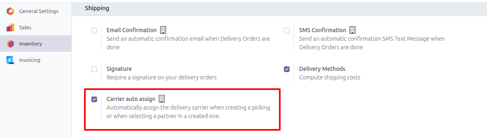
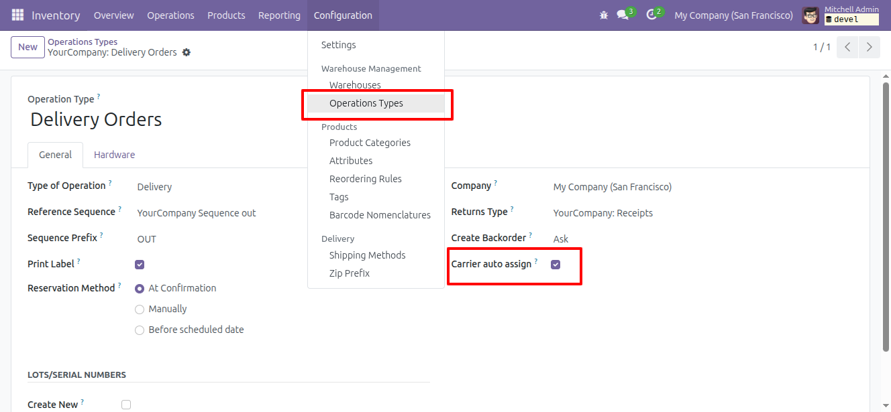

Configure auto assign carrier for company:
-------------------------------------

1. Go to Inventory > Configuration > Settings > Section Shipping
2. Find "Carrier auto assign" and enable it

   

Please note that enabling this setting will activate the "Carrier auto assign" option for all types of operations.
If you do not wish to use it for a particular type of operation, disable it.

Configure auto assign carrier for picking type:
-----------------------------------------------

1. Go to Inventory > Configuration > Operation types
2. Find "Carrier auto assign" and enable it

   
