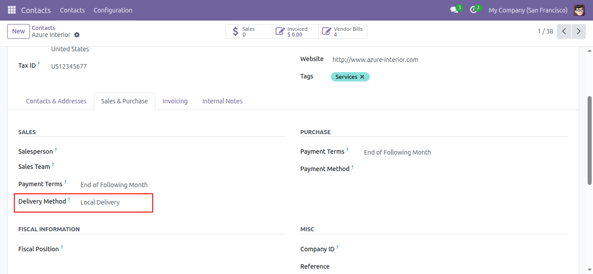
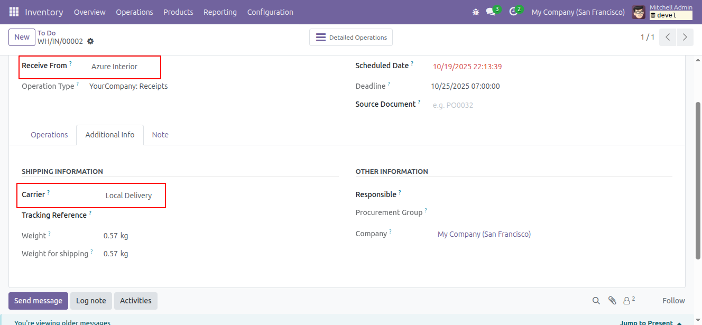
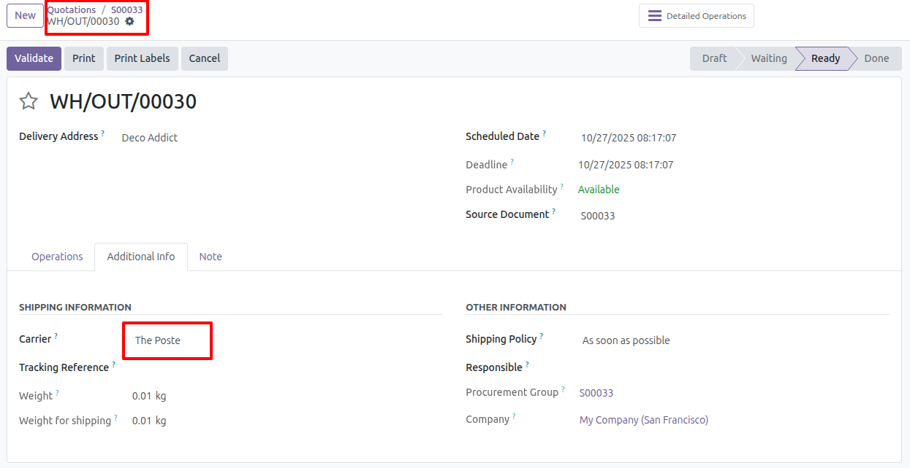

Configure shipping method in the contact
---------------------------------------

1. Go to Contacts or any other menu to access contacts.
2. Select the contact you want to configure the shipping method.
3. Go to the tab "Sales & Purchases" and select the shipping method.

Set shipping method on the picking
----------------------------------

1. Go to Inventory > Operations > Receipts
2. Create a new picking
3. Select the Receive From and the Shipping Method field
   will automatically be filled in on the Additional Information tab.

   

Set shipping method when creating a sales order
-----------------------------------------------

1. Go to Sales > Orders > Quotations
2. Create a new sale order
3. Add the partner, lines, and other necessary data, then confirm the sales order.
4. A picking will be created with the Carrier configured in the partner selected in the sales order.

   

Please note that for sections [Set shipping method on the picking](#set-shipping-method-on-the-picking) and [Set shipping method when creating a sales order](#set-shipping-method-when-creating-a-sales-order), the order of priority is as follows:
1. Delivery method of the primary contact (parent_id).
2. Delivery method of the contact.
